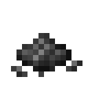

# Ash

**Ash**
When you use Stoves to burn some fuels,

you will get Ash items.

It can accelerate plants and crops' growing, just like the vanilla Bone Meals do.

## How to get

Every time Stoves consume a fuel item, it produces an Ash item.

When a block is burnt out, there is a small chance to drop an Ash item.

## How to use

It can be used to accelerate plants and crops' growing, just like the vanilla Bone Meals do.

If you wish, you can disable this function in configuration file.
