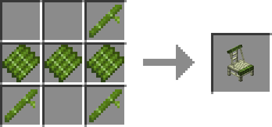
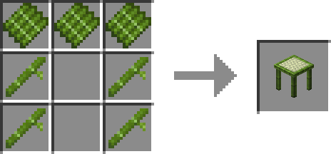
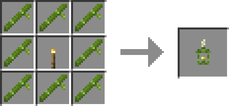
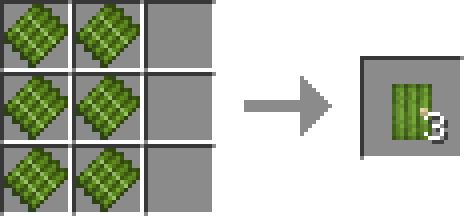

# Bamboo Decorations

*After the Drizzle* Mod adds a bunch of decorative blocks made from Bamboo.

Since there are few things to introduce, all information of bamboo decorations is posted here.

## 合成

