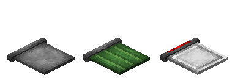
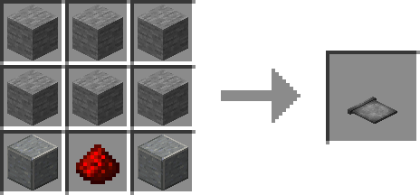
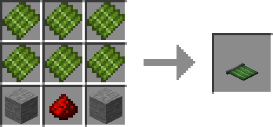
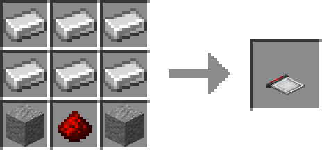
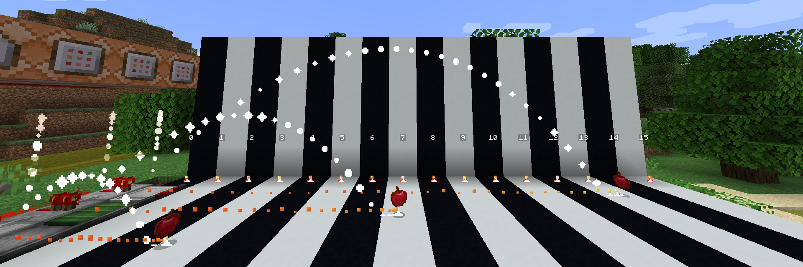
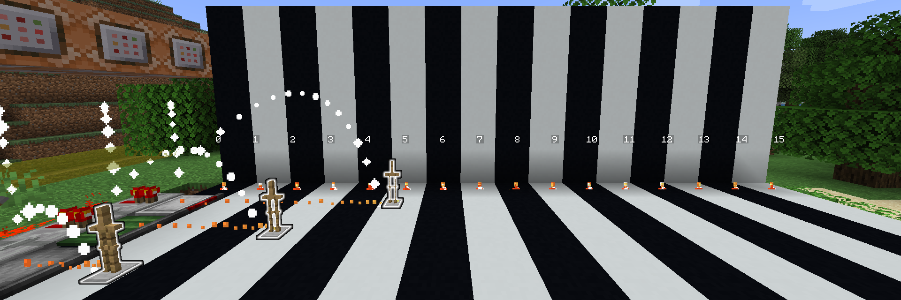

# 弹射板

**弹射板（Catapult Board）** 是一种可以弹射实体的方块，共有三种质地。

## 合成

## 用途

当弹射板被红石激活后，会将方块上的实体弹射出去。弹射距离由实体种类和弹射板的质地共同决定。

此外，竹匾可以放在石制弹射板上，组成[自动化竹匾](https://github.com/RoitoLeonine/After-the-Drizzle-Document/tree/d7c6ededfe3db16e8a95a3484ff5a4b4b4093472/blocks-items/blocks-items/bamboo-tray.md)。

