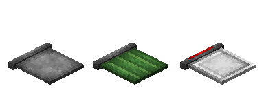
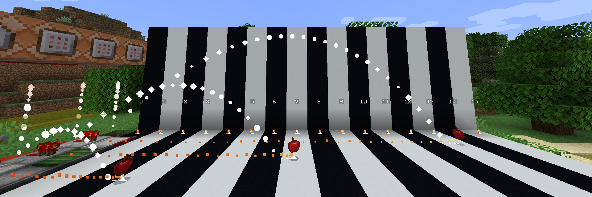
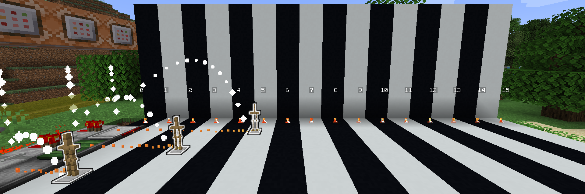

# Catapult Board

**Catapult Board**
is a utility block which can catapult entities.

It has 3 different variants.

## How to craft

## How to use

When it is redstone-activated, Catapult Boards will catapult the entity on it.

The range of the Catapult Board is decided by the types both catapulted entity's and the Catapult Board itself's.

Besides, [Bamboo Trays](blocks-items/bamboo-tray.md) can be put on Stone Catapult Boards, making them automated.
