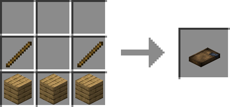

# Drink Maker

> Please use JEI to discover all drink-making recipes!

**Drink Maker**
is a utility block used for making drinks.

It takes 2-block space when it is placed, just like a Vanilla bed.

It can contain 2000mB (2 Buckets) of fluid.

## How to craft

## How to interact

Holding a fluid container (Vanilla Buckets, for example), and right-clicking the Drink Maker,

will add fluid into the Drink Maker, or take fluid in the Drinker Maker out.
