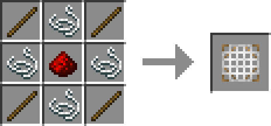
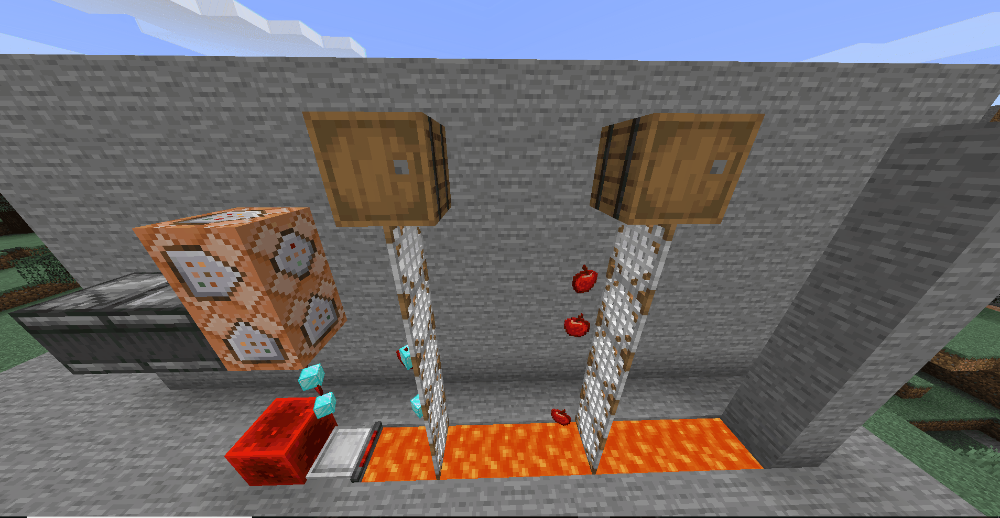

# Filter Screen

> Functions of this block is still under developing and testing, so it may not work as perfectly as this article says!

**Filter Screen** is a utility block used for filtering certain types of items as you want.

## How to craft

## How to use

- Right-click the Filter Screen with an empty hand to change direction it faces to.

- Put a container block on the Filter Screen, and put some items into that container block, then the filter will stop any item entities except entities of items in the container.

The container on the Filter Screen acts as a whitelist. 

If multiple Filter Screens stack vertically, they will use the nearest container which is above them as whitelist.

  

- Filter Screen only stops drop item entities, other types of entities can go through it easily.
