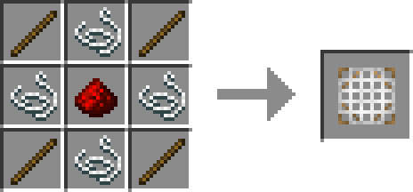
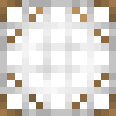

# 滤网

> 该方块仍在试验中，可能会出现过滤效果不佳的情况！

**滤网（Filter Screen）** 是模组加入一种的用于定向过滤物品实体的方块。

## 合成

## 使用

* 使用空手右击滤网可使滤网改变方向。
* 在滤网上方放置可存储物品的容器，并在其内放置物品，即可让该物品的实体通过滤网而不受阻拦。多个滤网在竖直方向上叠加时，都会以上方最近的容器作为白名单列表。

  

* 滤网不会阻拦其他实体穿过。

