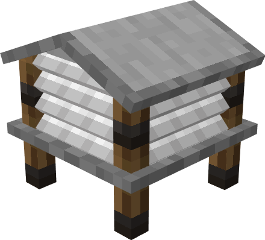

# Instrument Shelter

**Instrument Shelter** is a block to broadcast the weather forecast.

## How to craft
No picture. Please use JEI.

## How to use
After putting the hygrometer and the thermometer into the instrument shelter, right click the block to get the current weather forecast. (Not 100% credible)