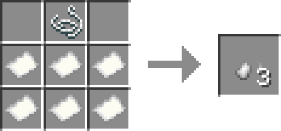
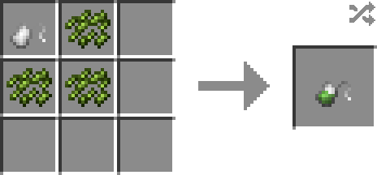
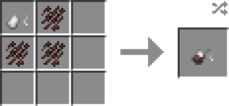

# Tea Bag

> Please use JEI to discover all Tea-making recipes!

**Tea Bag** is used for conviniently tea-making.

Now there are 2 variants of Tea Bags: Green Tea Bags and Black Tea Bags.

## How to craft

