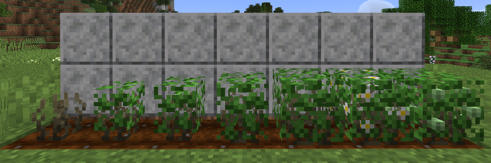

# Tea Plant

## (Wild) Tea Plant

**Tea Plants** are crops growing in Moist and Humid area.

It slows down players trying to go through it.

## Wild Tea Plants

Wild Tea Plants generated in biomes whose Humid is above Moderate.

Mining them will get 2-4 Tea Leaves and 1-2 Tea Tea Seeds.

## Tea Plants Growing

* **Proper Humid**：Above Moderate
* **Growth Stages**：
  * Seed, Sapling, Small Plant, Big Plant, Flourishing, Blooming, Setting Seeds.
  * Tea Plants will not come to Blooming stage until it is applied with Bone Meal.

## How to harvest

Right-clicking a Tea Plant in Flourishing or Setting Seeds stage will harvest from it.

