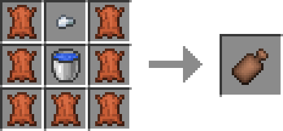
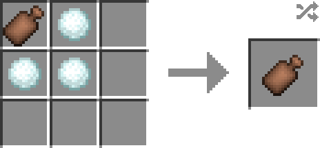

# Water Bag

**Water Bag** is an item provide heat/cold protection.

## How to craft

Smelt a Water Bag in a furnace and you will get Hot Water Bag.

## How to use
Water Bag always provides 1 point Heat resistant.

Hot/Ice Water Bag provides 2 point Cold/Heat resistant. Simply put it in the hotbar, and it will be enabled.

Hot/Ice Water Bag will work 5 minutes, then becomes Water Bag.

Only when it is enabled does Hot/Ice Water Bag consume its duration.
