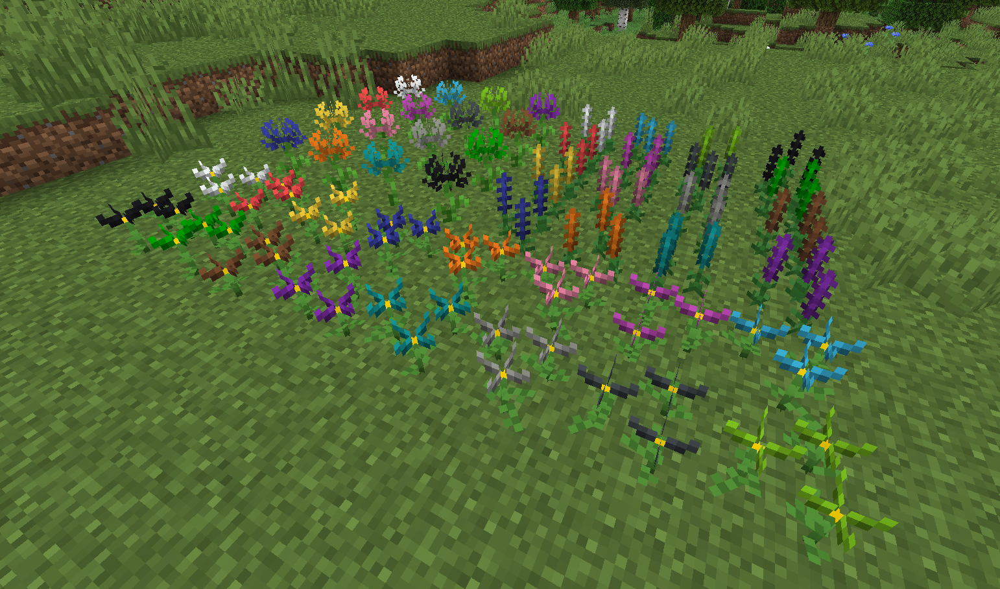

# 花朵杂交系统

**花朵杂交系统（Flower Hybridization System）**
是模组引入的一种新的玩法，每种花均可合成对应颜色两个染料。

## 花朵

- 菊花：
  - 自然生成环境：
    - 温度：~温暖；
    - 湿度：干燥~湿润；
- 百日菊：
    - 温度：凉爽~炎热；
    - 湿度：稀少~；
- 风信子：
    - 温度：~温暖；
    - 湿度：干燥~湿润；

## 杂交机制

- 每种花均有16种花色，可自然生成的花色有白色，红色，黄色和蓝色。

- 自交或同色杂交，产生同种颜色。
任何不在下面的花色杂交，均产生黑色。

- 使用骨粉或灰烬右键花朵，即可使花朵繁殖。

#### 一级杂交：

- 白色+红色=粉色

- 白色+蓝色=浅蓝色

- 红色+黄色=橙色

- 红色+蓝色=紫色

- 黄色+蓝色=绿色

#### 二级杂交：

- 白色+黑色=灰色

- 粉色+紫色=品红色

- 橙色+红色=棕色

- 绿色+蓝色=青色

- 绿色+黄色=黄绿色

- 绿色+白色=黄绿色

#### 三级杂交：

- 灰色+白色=浅灰色